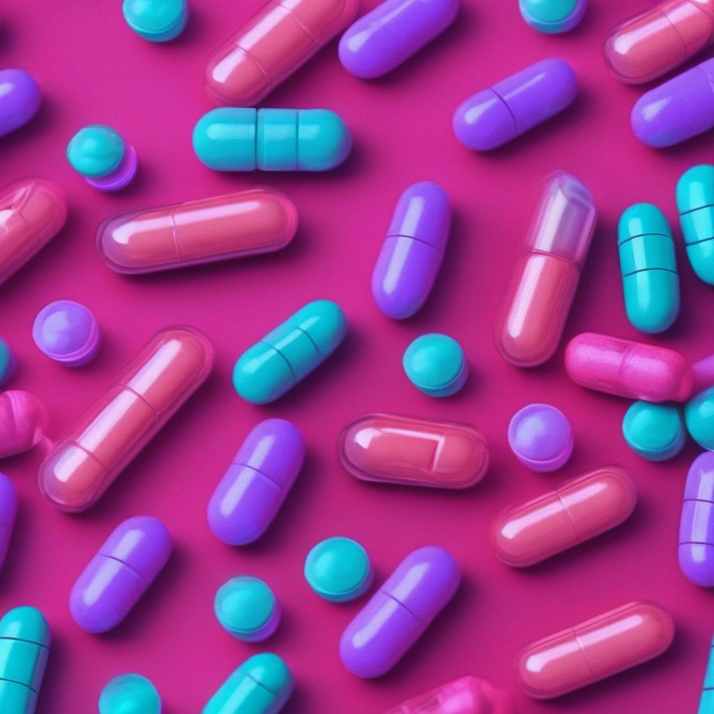

# **Homework Assignment: Pharmaceutical Research and Branding Project**

## **Project Overview:**

Congratulations! You have been hired by a pharmaceutical company specializing in neurological medications. Your task is to conduct a comprehensive study of patient feedback and research articles related to the drug Adderall, an effective treatment for attention deficit hyperactivity disorder (ADHD). You will then generate sentiment scores from patient reviews sourced from WebMD. Finally, you'll utilize natural language processing and generative AI models to produce branding materials for potential new drug names, logos, and marketing images.

### **Project Objectives:**

1\. **Research Summaries**:

   - Review the provided PDFs containing research articles on Adderall. Summarize the using a transformer model of your choice (T5, Llama 2, GPT-2, etc)

2\. **Sentiment Analysis**:

   - Utilize a Hugging Face model of your choice to generate sentiment scores from the drug reviews obtained from WebMD. Analyze the sentiment to gauge public perception, concerns, and opinions about Adderall.
   - BONUS: Generate a custom sentiment model using the full dataset found at [Kaggle](https://www.kaggle.com/datasets/mohamedabdelwahabali/drugreview)

3\. **Analysis and Insights**:

   - Develop an analysis based on the collected data from research articles and sentiment scores. Identify strengths, weaknesses, patterns, opportunities, and threats concerning the drug's perception and market potential.

4\. **Branding and Marketing Materials**:

   - Generate branding materials using Hugging Face models:

       - Create five potential new drug names inspired by the core attributes of Adderall.

       - Design one logo that symbolizes the essence of the new drug names and represents the intended impact of the drug.

       - Develop three potential marketing images that convey the benefits and impact of the new drug in a visually compelling manner.

### **Submission Details:**

1\. **Research Summaries**:

   - Submit a md file, dashboard, or powerpoint summarizing the key points from the provided research PDFs.

2\. **Sentiment Analysis**:

   - Provide a md file, dashboard, or powerpoint showcasing the sentiment scores obtained from the WebMD drug reviews. (This can be combined with previous steps)

3\. **Branding and Marketing Materials**:

   - Present the generated branding materials, including:

       - A document featuring five new drug names inspired by your research.

       - At least one logo design representing the essence of the new drug names.

       - Three marketing images portraying the impact and benefits of the new drug.

